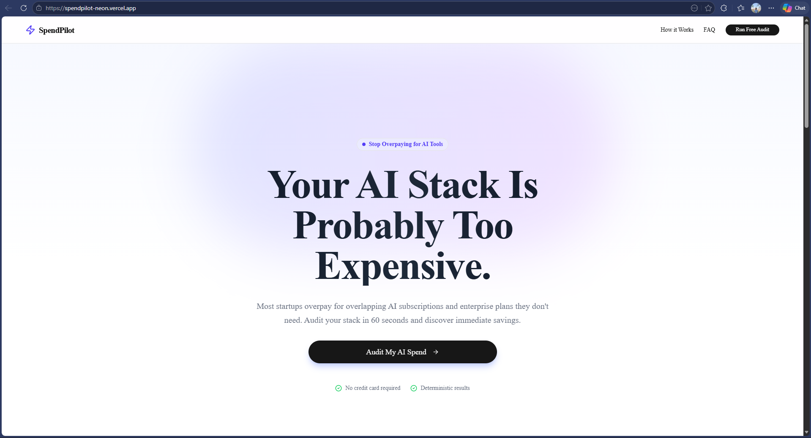
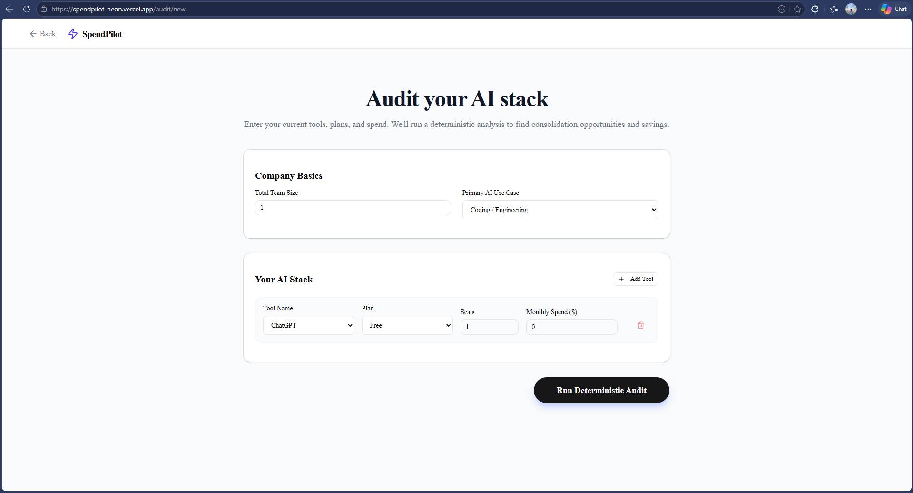
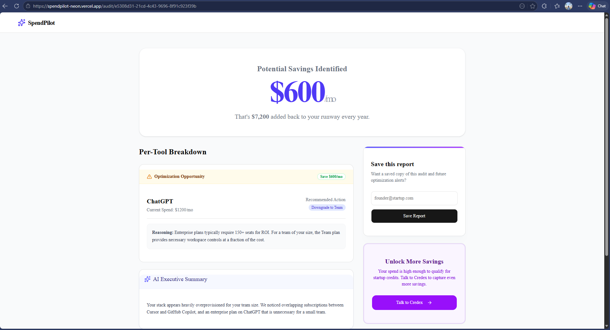

# SpendPilot - AI Spend Audit SaaS

SpendPilot is a production-quality startup MVP built to help engineering teams and startup founders audit their AI tool stack, discover overlapping subscriptions, and optimize their burn rate.

🌐 Live Demo: https://spendpilot-neon.vercel.app/

---

## 🚀 Overview

Many startups overpay for redundant AI tools (e.g., Cursor + Copilot) or enterprise plans they don't need. SpendPilot uses a deterministic pricing engine to analyze a user's AI stack, calculate exact monthly and annual savings, and generate a personalized executive summary.

### Key Features
- Deterministic Audit Engine
- Dynamic Tool Stack Builder
- AI Executive Summary (Groq)
- Shareable Reports
- Lead Capture via Resend
- Public Audit URLs
- Mobile Responsive UI

---

## 📸 Product Screenshots

### Landing Page



### Audit Form



### Savings Report



---

## 🛠 Tech Stack

- Framework: Next.js 15 (App Router)
- Language: TypeScript
- Styling: Tailwind CSS + shadcn/ui
- Database: Supabase (PostgreSQL)
- AI: Groq API (llama-3.3-70b-versatile)
- Emails: Resend
- Validation: Zod + React Hook Form
- Testing: Vitest

---

## 💻 Local Setup

1. Clone the repository

```bash
git clone YOUR_REPO_URL
```

2. Install dependencies

```bash
npm install
```

3. Create `.env.local`

```env
NEXT_PUBLIC_SUPABASE_URL=
NEXT_PUBLIC_SUPABASE_ANON_KEY=

GROQ_API_KEY=

RESEND_API_KEY=

NEXT_PUBLIC_APP_URL=
```

4. Run database schema

Execute:

```bash
supabase/migrations/0000_initial.sql
```

inside your Supabase SQL editor.

5. Start development server

```bash
npm run dev
```

---

## 🌍 Deployment

This project is optimized for deployment on Vercel.

Production URL:

https://spendpilot-neon.vercel.app/

---

## 🧠 Product Philosophy

SpendPilot intentionally uses deterministic pricing logic rather than AI-generated calculations to avoid hallucinated savings estimates. LLMs are only used for executive-summary generation and communication polish.

---

## ⚖️ Key Product Decisions

### 1. Deterministic Audit Logic
AI was intentionally excluded from pricing calculations to ensure accuracy and explainability.

### 2. Lead Capture After Value
Users receive their audit before any email gate, improving trust and conversion quality.

### 3. Public Shareable Reports
Reports are optimized for screenshots and team sharing, enabling organic distribution loops.

### 4. Minimal SaaS Design
The interface intentionally prioritizes readability, whitespace, and focus over dashboard complexity.

### 5. Groq Instead of Anthropic
Groq was selected for faster iteration speed and lower development friction while maintaining high-quality executive summaries.

---

## ✅ Current Status

- Fully deployed on Vercel
- Supabase connected
- Groq summaries operational
- Resend email integration operational
- CI/CD configured
- Deterministic pricing engine tested
